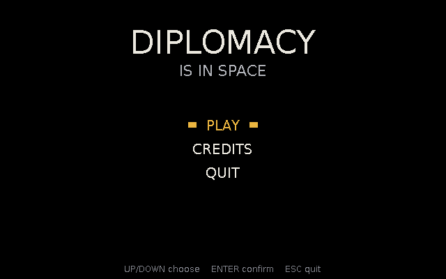
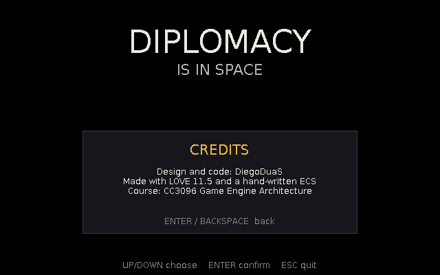
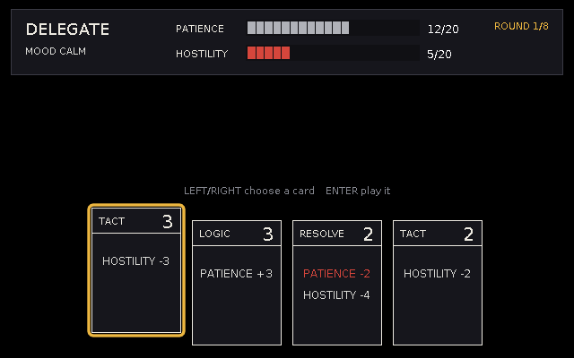
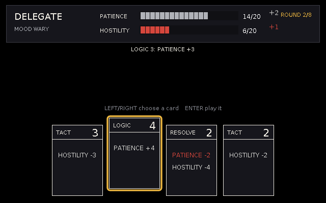
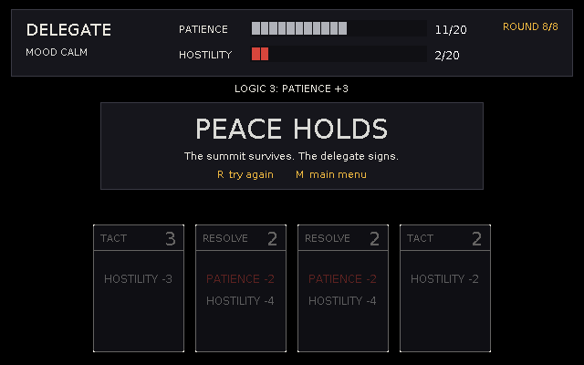

# Diplomacy Is In Space

Deckbuilder de diplomacia espacial hecho en [LÖVE](https://love2d.org) 11.5 sobre un ECS escrito a mano (engine del curso CC3096).

Eres el único operador de una estación que recibe una cumbre con razas alienígenas. En vez de ligar, juegas **cartas de negociación** para manejar la **paciencia** y la **hostilidad** de cada delegado y evitar una guerra espacial. Cada día llega una raza distinta y tu mazo mejora entre rondas.

```sh
love .                    # menú principal
love . negotiation        # directo a una negociación
love . --debug            # editor del engine: inspector del registry + cambio de escena
```

## Ramas (una por entrega, cada una construida sobre la anterior)

| Rama | Contenido |
|---|---|
| `main` | Base ECS (Registry + Scene) heredada del ejercicio de Breakout |
| `entrega-1-ui` | Limpieza de Breakout + 3 sistemas de UI (esta rama) |

---

# Entrega 1 — Sistemas de UI

Esta primera entrega es deliberadamente básica: **texto y rectángulos sobre fondo negro**. Todavía no hay nombres de cartas ni de delegados, ni fondo, ni figuras; eso llega en las siguientes entregas.

## Limpieza

Se eliminó todo el código de Breakout (commit `chore: remove all Breakout code`): los 11 systems de juego, el helper de colisión AABB, el README y el gif. Solo sobrevivió el núcleo ECS, que luego se actualizó con el engine del curso (`Game`, resources, debug overlay). Los sistemas del juego actual usan nombres y datos propios (`src/data/`).

## Los 3 sistemas de UI

Cada UI es un grupo de systems atómicos (una responsabilidad por system) que cubren **Setup → Update → Render**:

- **Setup**: la escena crea las entidades de la UI (posición, opciones, valores iniciales, referencia al estado) y los systems cargan sus fuentes en `setup(scene)` / spawnean su entidad.
- **Update**: los systems de input convierten teclas en eventos (`menuPicked`, `cardPlayRequested`) y otros systems reaccionan al evento y al estado.
- **Render**: systems de solo lectura que dibujan en coordenadas de pantalla (la UI no depende de ninguna cámara del mundo).

### 1. Menú principal — [`MenuScene`](src/scenes/MenuScene.lua)

| Fase | Dónde |
|---|---|
| Setup | `MenuScene` spawnea la entidad `menu` (opciones PLAY / CREDITS / QUIT, cursor) y el resource `credits`; `MenuRenderSystem.setup` carga las fuentes |
| Update | [`MenuInputSystem`](src/systems/MenuInputSystem.lua) (teclas → cursor, evento `menuPicked`) y [`MenuActionSystem`](src/systems/MenuActionSystem.lua) (`menuPicked` → cambiar de escena, abrir créditos, salir) |
| Render | [`MenuRenderSystem`](src/systems/MenuRenderSystem.lua) (título, menú con cursor parpadeante, panel de créditos) |

**Conexión con el juego:** es la puerta de entrada; PLAY cambia de escena mediante un `switchRequest` que atiende el `Game`, sin que ninguna escena llame a otra directamente.

### 2. HUD de negociación — [`NegotiationScene`](src/scenes/NegotiationScene.lua)

| Fase | Dónde |
|---|---|
| Setup | [`HudSystem.setup`](src/systems/HudSystem.lua) spawnea la entidad `hud` (valores mostrados, cambios flotantes) leyendo el estado inicial; `HudRenderSystem.setup` carga fuentes |
| Update | `HudSystem.update` hace que las barras persigan el estado real (`negotiation`) con easing y muestra los cambios flotantes al recibir `negotiationChanged` |
| Render | [`HudRenderSystem`](src/systems/HudRenderSystem.lua): humor del delegado (CALM/WARY/TENSE/FURIOUS), barras de **paciencia** y **hostilidad**, ronda actual, última jugada y banner de resultado (paz / guerra / abandono) |

**Conexión con el juego:** paciencia y hostilidad son *la* mecánica central. El HUD lee el resource `negotiation` que escribe [`NegotiationSystem`](src/systems/NegotiationSystem.lua) y nunca lo modifica.

### 3. Mano de cartas — [`NegotiationScene`](src/scenes/NegotiationScene.lua)

| Fase | Dónde |
|---|---|
| Setup | `NegotiationScene` spawnea la entidad `hand` (4 cartas del mazo inicial, cursor); `HandRenderSystem.setup` carga fuentes |
| Update | [`HandInputSystem`](src/systems/HandInputSystem.lua) (←/→ mueve el cursor, ENTER emite `cardPlayRequested`); `NegotiationSystem` aplica el efecto de la carta y repone la mano |
| Render | [`HandRenderSystem`](src/systems/HandRenderSystem.lua) coloca las cartas y levanta la seleccionada; cada carta la dibuja [`CardRenderer`](src/cards/CardRenderer.lua) (tipo, poder y efecto; aún sin nombre ni símbolo) |

**Conexión con el juego:** es el deckbuilder. Cada carta tiene un tipo (TACT, LOGIC, RESOLVE) y un poder; su efecto sobre los medidores lo calcula la función pura [`CardEffect`](src/cards/CardEffect.lua):

| Tipo | Efecto por punto de poder |
|---|---|
| TACT | hostilidad −1 |
| LOGIC | paciencia +1 |
| RESOLVE | hostilidad −2, paciencia −1 |

Cada ronda el delegado pierde 1 de paciencia y gana hostilidad según su temperamento ([`aliens.lua`](src/data/aliens.lua)). Sobrevives 8 rondas → paz; hostilidad al máximo → guerra; paciencia en 0 → el delegado se va.

## Controles

| Pantalla | Teclas |
|---|---|
| Menú | ↑ ↓ mover, ENTER elegir, BACKSPACE cerrar créditos |
| Negociación | ← → elegir carta, ENTER jugarla; al terminar: R reintentar, M menú |
| Global | ESC salir |

## Evidencia visual

| Menú | Créditos |
|---|---|
|  |  |

| Negociación (inicio) | Carta jugada (barras animadas) | Resultado |
|---|---|---|
|  |  |  |

> El GIF/video corto para el portafolio se graba jugando: `love .` → PLAY → jugar varias cartas hasta ver el banner.

## Estructura

```
main.lua                    bootstrap: registra escenas y reenvía callbacks
src/Game.lua                escenas, cambio diferido (switchRequest), keyPressed como evento
src/ecs/                    Registry + Scene (engine del curso)
src/scenes/                 MenuScene, NegotiationScene
src/systems/                un archivo por system
src/cards/                  CardEffect (regla pura) y CardRenderer (dibujo)
src/graphics/               Panel
src/data/                   paleta, delegados, tipos de carta, reglas, mazo inicial
src/debug/ lib/             debug overlay del curso (inspector del registry)
```
