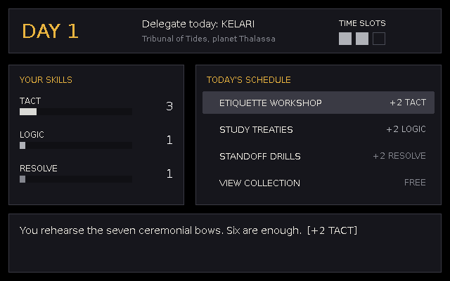
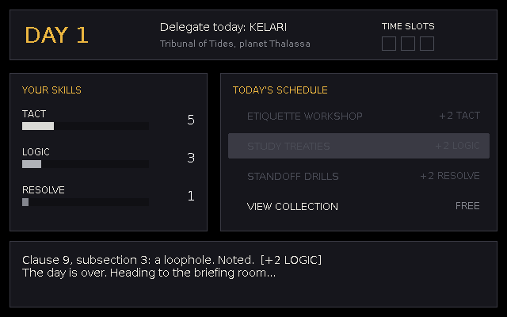
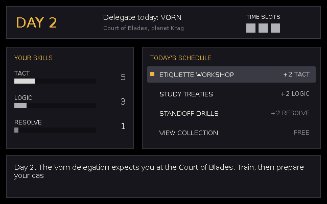
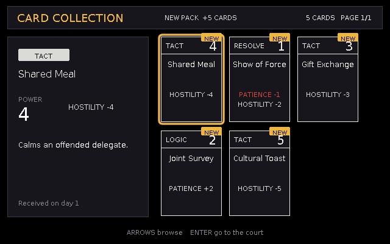
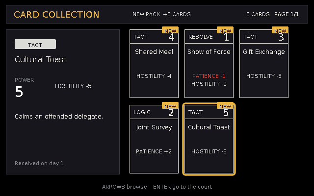
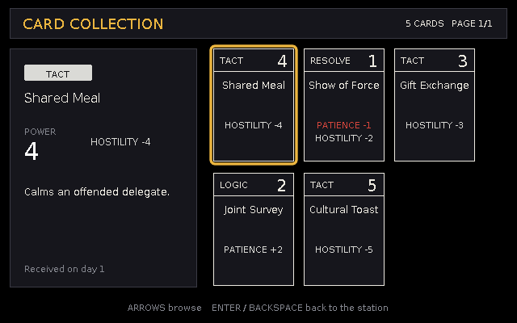
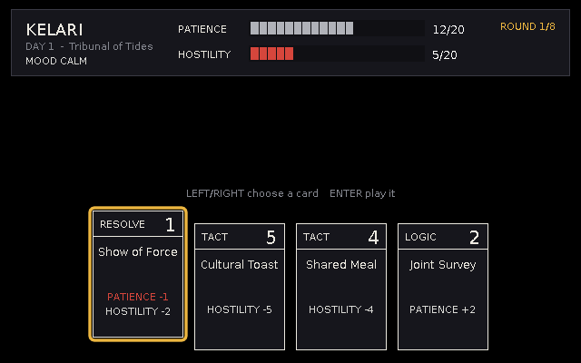
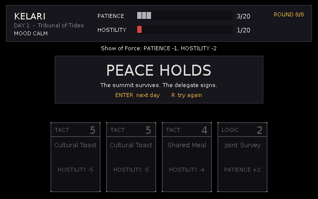

# Diplomacy Is In Space

Deckbuilder de diplomacia espacial hecho en [LÖVE](https://love2d.org) 11.5.

Eres el único operador de una estación que recibe una cumbre con razas alienígenas. Tu juegas **cartas de negociación** para manejar la **paciencia** y la **hostilidad** de cada delegado y evitar una guerra espacial. Cada día llega una raza distinta y tu mazo mejora entre rondas.

```sh
love .                    # menú principal -> PLAY
```

---

# Entrega 2 — Progression Cycle

Esta entrega sigue el mismo estilo de la primera (texto y rectángulos sobre fondo negro) y le agrega el ciclo del día alrededor de la negociación. Aparecen los nombres de las cartas y de las delegaciones, porque ahora el juego cuenta a quién vas a ver y por qué.

## El ciclo

```
DÍA N: la delegación de una raza te espera en su tribunal
   │
   ▼
[Estación] gastas 3 "time slots" en acciones que entrenan tus habilidades
   │          Etiquette Workshop → +2 TACT   Study Treaties → +2 LOGIC   Standoff Drills → +2 RESOLVE
   ▼
[Briefing] recibes un paquete de 5 cartas generado desde tus habilidades → colección persistente
   │
   ▼
[Corte] defiendes tu caso ante el delegado (la negociación), con una mano sacada de tu colección
   │        paz / guerra / abandono según cómo manejes su paciencia y su hostilidad
   ▼
Fin del día → DÍA N+1 (otra raza); la colección conserva todo
```

Lo que haces en la estación determina las cartas del briefing, y esas cartas son las que juegas en la corte: entrenar mucho **TACT** llena tus paquetes de cartas TACT, que son las que bajan la hostilidad del delegado.

## Parte 1 — Pantalla de progresión ([`PrepScene`](src/scenes/PrepScene.lua))

| Requisito | Cómo se cumple |
|---|---|
| 2+ acciones | 3 acciones ([`actions.lua`](src/data/actions.lua)) + una entrada gratuita "VIEW COLLECTION" |
| 2+ estadísticas | 3 habilidades: `tact`, `logic`, `resolve` (barras a la izquierda) |
| Momento de la partida | "DAY N" arriba, la delegación del día y los **time slots** restantes |
| Feedback tras decidir | Línea de sabor + `[+2 TACT]` en el textbox con efecto typewriter; las barras suben |
| Condición para avanzar | Al gastar el último slot, tras 3 s ([`ProgressionGateSystem`](src/systems/ProgressionGateSystem.lua)) se pasa al briefing |

Los números (3 slots, +2 por acción, umbral de las barras, espera) están en [`progression_rules.lua`](src/data/progression_rules.lua).

| Tras una acción | Último slot | Día 2 (otra delegación) |
|---|---|---|
|  |  |  |

## Parte 2 — Adquisición y colección ([`CollectionScene`](src/scenes/CollectionScene.lua))

Una sola escena con dos entradas:

- `payload = { acquire = true }` (desde el briefing): genera el paquete del día, lo agrega a la colección, marca las cartas nuevas con **NEW** y, al continuar, va a la corte.
- sin payload (opción "VIEW COLLECTION" en la estación): solo revisión; al volver, la colección queda intacta.

Navegación con flechas / HOME / END por páginas de 6 cartas; el panel izquierdo inspecciona la carta seleccionada (tipo, poder, efecto sobre paciencia/hostilidad, descripción y el día en que se recibió).

| Paquete recibido | Navegación | Revisión posterior (sin perder cartas) |
|---|---|---|
|  |  |  |

### Regla de generación ([`CardGenerator`](src/generation/CardGenerator.lua))

1. El **tipo** de cada carta se sortea con probabilidad proporcional a la habilidad correspondiente. Con TACT 20 / LOGIC 5 / RESOLVE 10, salen ≈ 57 % / 14 % / 29 %.
2. El **poder** se sortea entre el 50 % y el 100 % de la habilidad de ese tipo (mínimo 1): entrenar sube el techo *y* el piso.
3. Una habilidad en 0 nunca produce su tipo.

La regla es una función pura con RNG inyectado; cada paquete usa un RNG local sembrado con `runState.packSeed`, así que cualquier paquete se puede reproducir.

### Cierre del ciclo: la corte ([`NegotiationScene`](src/scenes/NegotiationScene.lua) con `payload.run`)

Al continuar desde el briefing se entra a la negociación de la Entrega 1, ahora como caso del día: el delegado es el de ese día (`aliens.ofDay`), la **mano se reparte desde tu colección** (barajada por día) y al terminar, ENTER lanza `dayEnded` y [`EndDaySystem`](src/systems/EndDaySystem.lua) pasa al día siguiente. R reintenta el caso. Sin `payload.run` (`love . negotiation`) sigue siendo la negociación suelta de la Entrega 1 con el mazo inicial.

| La corte: mano sacada de tu colección | Resultado y paso al día siguiente |
|---|---|
|  |  |

## Arquitectura

### Estado compartido — [`RunState`](src/state/RunState.lua)

Una sola tabla de **datos simples** que todas las escenas leen y escriben; vive en un módulo, no en una escena, por eso sobrevive al cambio de escena:

```lua
{ day = 1, actionsLeft = 3,
  stats = { tact = 1, logic = 1, resolve = 1 },
  collection = { { kind = "tact", name = "Warm Greeting", power = 4, day = 1 }, ... },
  packSeed = 1 }
```

No guarda imágenes, funciones, systems, escenas ni objetos gráficos ([`tests/run_state.lua`](tests/run_state.lua) lo verifica recorriendo la tabla). Cada escena la expone como resource `runState` para que el inspector del debug overlay la muestre en vivo. Lo que es solo de una escena (cursor, typewriter, gate, página) vive en resources de la escena y muere con ella. Guardar en disco es opcional y no se implementó.

### Systems (una responsabilidad cada uno, comunicados por eventos)

**Estación** (`PrepScene`):

| System | Hooks | Responsabilidad |
|---|---|---|
| [`MenuInputSystem`](src/systems/MenuInputSystem.lua) | update | teclas → cursor + evento `menuPicked` |
| [`ActionSystem`](src/systems/ActionSystem.lua) | update | `menuPicked` → habilidades y slots; emite `actionPerformed` / `actionRefused` |
| [`PrepNavigationSystem`](src/systems/PrepNavigationSystem.lua) | update | `menuPicked` de "collection" → cambio de escena |
| [`FeedbackSystem`](src/systems/FeedbackSystem.lua) | update | `actionPerformed` → texto |
| [`TextboxSystem`](src/systems/TextboxSystem.lua) | update | typewriter |
| [`ProgressionGateSystem`](src/systems/ProgressionGateSystem.lua) | setup, update | 0 slots → pasar al briefing |
| [`DayRenderSystem`](src/systems/DayRenderSystem.lua), [`StatsRenderSystem`](src/systems/StatsRenderSystem.lua), [`ActionMenuRenderSystem`](src/systems/ActionMenuRenderSystem.lua), [`TextboxRenderSystem`](src/systems/TextboxRenderSystem.lua) | setup (fuentes), draw | presentación pura |

**Briefing / colección** (`CollectionScene`):

| System | Hooks | Responsabilidad |
|---|---|---|
| [`CollectionInputSystem`](src/systems/CollectionInputSystem.lua) | update | teclas → `collectionMoveRequested`, `collectionJumpRequested`, `continueRequested` |
| [`PackGenerationSystem`](src/systems/PackGenerationSystem.lua) | update | `packRequested` → llama al generador y agrega a la colección |
| [`CollectionSelectionSystem`](src/systems/CollectionSelectionSystem.lua) | update | dueño del cursor y la página |
| [`CollectionExitSystem`](src/systems/CollectionExitSystem.lua) | update | qué significa "continuar" (ir a la corte o volver a la estación) |
| [`CollectionChromeRenderSystem`](src/systems/CollectionChromeRenderSystem.lua), [`CollectionGridRenderSystem`](src/systems/CollectionGridRenderSystem.lua), [`CardDetailRenderSystem`](src/systems/CardDetailRenderSystem.lua) | setup (fuentes), draw | marco, rejilla de cartas, inspector |

**Corte** (`NegotiationScene` con `run`): los de la Entrega 1 más [`EndDaySystem`](src/systems/EndDaySystem.lua), único escritor del ciclo de días (`dayEnded` → día+1, slots y vuelta a la estación). `OutcomeInputSystem` corre antes de `NegotiationSystem` para que la tecla que decide el resultado no lo descarte en el mismo frame.

Separación lógica / datos / presentación: la regla de cartas (`CardGenerator`, `CardEffect`) es pura y no conoce la UI; los datos están en `src/data/`; los render systems solo leen. El input nunca genera cartas ni cambia de escena: solo emite eventos. Cada system implementa únicamente los hooks que usa.

## Controles

| Pantalla | Teclas |
|---|---|
| Estación | ↑ ↓ elegir, ENTER hacer la acción |
| Colección | ← → ↑ ↓ mover, HOME / END, ENTER (ir a la corte) o ENTER / BACKSPACE (volver) |
| Corte | ← → elegir carta, ENTER jugarla; al terminar ENTER día siguiente, R reintentar |
| Global | ESC salir |

> El GIF para el portafolio: `love .` → PLAY → 3 acciones → paquete → ENTER (corte) → jugar cartas hasta el resultado → ENTER (día 2) → VIEW COLLECTION.

---

# Entrega 1 — Sistemas de UI (resumen)

Menú principal, HUD de negociación (paciencia / hostilidad) y mano de cartas, con Setup → Update → Render cada uno. En esta rama la negociación es la corte del ciclo de días. Detalle en el README de la Entrega 1 y capturas en `docs/img/e1-*.png`.

## Estructura

```
main.lua                    bootstrap: registra escenas y reenvía callbacks
src/Game.lua                escenas, cambio diferido (switchRequest), keyPressed como evento
src/ecs/                    Registry + Scene (engine del curso)
src/scenes/                 MenuScene, PrepScene, CollectionScene, NegotiationScene
src/systems/                un archivo por system
src/state/                  RunState (estado compartido, solo datos)
src/generation/             CardGenerator (regla pura de cartas)
src/cards/                  CardEffect (regla pura) y CardRenderer (dibujo)
src/graphics/               Panel
src/data/                   paleta, delegaciones, acciones, tipos y nombres de carta, reglas, mazo inicial
src/debug/ lib/             debug overlay del curso (inspector del registry)
tests/                      pruebas en Lua puro
```
